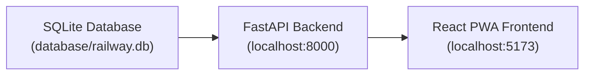
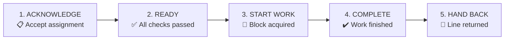

# SIH26027 — Feature Guide & Demo Walkthrough

> **Prototype demonstration using synthetic data. Not for live Railway operations.**

---

## Architecture

The SQLite database holds 16 tables with 22 mock tasks, 672 train paths, 6 resources, and 3 block sections across 4 stations. The React app **never** touches the database directly — everything flows through the FastAPI REST API.

---

## 1. Login & Role-Based Access

**Route:** `/login`

| Role | Redirect | What They See |
|------|----------|---------------|
| SECTION_CONTROLLER | `/dashboard` | Full desktop dashboard with planning, analytics, what-if |
| DIVISIONAL_OFFICER | `/dashboard` | Same desktop view (oversight role) |
| FIELD_SUPERVISOR | `/field` | Mobile-first field execution app |

**How it works:**
- Select a role from the dropdown, click "Enter Operations Console"
- Role and employee ID are saved to `localStorage`
- The app redirects you to the correct interface based on your role
- No real authentication (prototype) — any password works

---

## 2. Dashboard (Controller View)

**Route:** `/dashboard`

**What it shows:**
- **8 KPI Cards** — Total Tasks (22), Open Tasks, Lane A Emergency count, Lane B2 Statutory count, Lane B1 Planned count, High Readiness %, Plans Generated, Estimated Train Impact
- **Train Impact Chart** — Visual comparison of baseline vs Plan A vs Plan B train detention
- **Resource Utilization Chart** — How machines and gangs are being used
- **Risk Cards** — Active operational risks (TSR violations, overdue tasks, etc.)
- **Upcoming Tasks** — Next tasks due for execution

**Data source:** All numbers come from the FastAPI backend which queries the SQLite database in real-time.

---

## 3. Tasks

**Route:** `/tasks`

**What it shows:**
- A filterable list of all 22 maintenance tasks from the database
- Each task card shows: Task Code, Department (ENGINEERING / TRD / S&T), Lane badge, KM range, estimated duration, readiness flags

**Route:** `/tasks/:id`

- Clicking a task opens its detail page
- Shows: full task info, classification result (which lane it belongs to), readiness checklist, duration breakdown

**How the Lane Classification works (backend logic):**

| Lane | Rule | Optimizer? |
|------|------|-----------|
| **A_EMERGENCY** | Safety-critical / defect-triggered | ❌ Bypass optimizer, manual Railway procedure |
| **B1_PLANNED** | Routine preventive maintenance | ✅ Sent to CP-SAT optimizer |
| **B2_STATUTORY** | Mandatory inspection with hard deadline | ✅ Optimizer respects deadline as hard constraint |

---

## 4. AI Block Planning (OR-Tools CP-SAT)

**Route:** `/planning`

**What happens when you click "Generate Optimal Plan":**

1. Frontend sends `POST /api/plans/generate` to backend
2. Backend loads all 22 tasks and all block windows from the database
3. Tasks are classified — Lane A tasks are excluded (they bypass the optimizer)
4. The **Google OR-Tools CP-SAT solver** runs:
   - Creates boolean decision variables: `assign[task_id, window_id]`
   - **Constraint 1:** Each task assigned to at most 1 window
   - **Constraint 2:** Each window handles at most 3 compatible tasks (bundling)
   - **Constraint 3:** B2 statutory deadlines are hard constraints
   - **Objective:** Maximize total priority score of assigned tasks
   - Solver runs for up to 10 seconds
5. Returns: solver status (OPTIMAL / FEASIBLE / HEURISTIC), assigned tasks, and explanation
6. Plan is saved to `block_plans` table in the database
7. Frontend shows **Plan A** (optimal) and **Plan B** (alternative) side by side
8. Click **"Inspect & Authorize Plan"** to see the full schedule timeline

**Plan Actions:**
- **Approve** — Mark plan as APPROVED (saved to database)
- **Reject** — Mark as REJECTED
- **Override** — Manual override with reason (audit logged)

---

## 5. Train Graph

**Route:** `/train-graph`

**What it shows:**
- A time-distance diagram (SVG-based)
- **X-axis:** Time of day (hours)
- **Y-axis:** 4 stations with KM chainage (Station A at 0km → Station D at 58km)
- **Diagonal lines:** Train paths (Express in blue, Freight in amber, Passenger in green)
- **Shaded rectangles:** Proposed block windows where maintenance will happen
- **Red zones:** TSR (Temporary Speed Restriction) sections
- Hover over any train to see: train number, class, direction, timing
- Time range selector: 6h / 12h / 24h view

**Purpose:** Lets the controller visualize exactly where maintenance blocks overlap with train movements, so they can see the trade-off.

---

## 6. Block Details

**Route:** `/blocks/:id`

**What it shows:**
- Block ID, Section, Line, KM range, Start/End time
- **Duration Breakdown Bar:** Setup → Work → Clearance → Handback (stacked horizontal bar showing how the block time is split)
- **Bundled Tasks:** Which tasks from different departments (Engineering + TRD) are combined into this single block
- **Cost Breakdown:** Train impact cost, TSR cost, failure risk cost
- **Readiness Indicators:** Machine ✅, Gang ✅, Material ✅, PTW ✅
- **AI Explanation:** _"Selected because compatible Engineering + TRD tasks can be combined, readiness is high, and estimated train-impact cost is lower."_

---

## 7. What-If Scenario Analysis

**Route:** `/what-if`

**7 pre-built disruption scenarios:**

| Scenario | What it simulates |
|----------|------------------|
| Machine Unavailable | Tamping Machine breakdown — 3 tasks can't proceed |
| Machine Delayed | BCM machine 60-min late — block window compressed |
| Gang Unavailable | Track Gang G-101 unavailable — manual tasks blocked |
| Block Window Removed | Controller cancels the 02:00–05:00 window — 5 tasks need reassignment |
| Duration Increased | 50% overrun probability — buffer time insufficient |
| Train Volume Increased | 2 special rakes inserted — maintenance windows shrink |
| Weather Unsuitable | High winds — all OHE tower wagon work suspended |

**What happens when you click a scenario:**
1. Frontend sends `POST /api/plans/{id}/what-if` with the scenario name
2. Backend runs the disruption model and returns:
   - **Train Impact Change** (e.g., "+18 mins")
   - **Cost Change** (e.g., "+₹ 12,400")
   - **Risk Warnings** (e.g., "B2 Statutory task may miss deadline")
   - **Explanation** (full narrative of what the solver would do)
3. Frontend shows Original Plan vs Revised Disruption Model side-by-side

---

## 8. Analytics

**Route:** `/analytics`

**Charts available:**
- **Planned vs Actual** — Compare scheduled block durations against actual execution times
- **Train Impact Analytics** — Hourly breakdown of train detention across corridor
- **Resource Utilization** — Machine and gang usage rates
- **Task Completion** — Department-wise completion rates (Engineering / TRD / S&T)

---

## 9. Field Execution (Mobile PWA)

> Login as **FIELD SUPERVISOR** to access this view.

### 9a. Field Home (`/field`)
- Shows "My Assigned Blocks" as large touch-friendly cards
- Each card: Block ID, Section, KM range, Time window, Readiness badge
- Online/Offline indicator at top
- Bottom navigation: Home | Tasks | Notifications | Profile

### 9b. Field Tasks (`/field/tasks`)
- List of all assigned tasks with department badges and lane badges
- **Readiness Checklist** with 6 large checkboxes:
  - ☐ Gang available
  - ☐ Machine arrived/reachable
  - ☐ Material available
  - ☐ PTW / Isolation / Disconnection ready
  - ☐ Safety tools / PPE ready
  - ☐ Worksite access confirmed
- Dynamically calculates readiness: if < 4 checked → shows **LOW** warning
- If plan changed: shows OLD vs NEW times with **ACKNOWLEDGE** button

### 9c. Field Execution (`/field/execute/:taskId`)

**The 5-Tap Execution Flow:**

- Each step is a giant button (mobile-friendly)
- Timestamps are recorded automatically at each tap
- At **COMPLETE** step: if block overran, a **Loss Reason selector** appears with 10 Indian Railway loss codes:
  - Late Line Clear, Late Start, Machine Failure, Material Shortage, PTW Delay, Weather, Staff Shortage, Track Conflict, Signal Failure, Other
- All events are saved to **IndexedDB** for offline support
- When back online, events sync to the backend

---

## 10. Notifications (`/notifications`)

- Grouped by status: Pending → Sent → Acknowledged → Expired
- Each notification shows: message, timestamp, plan version
- **Acknowledge** button to confirm receipt
- Mock data with 6 realistic railway notifications

---

## 11. Profile (`/profile`)

- Shows: Employee ID, Role, Division, Last Sync time
- **Logout** button (clears localStorage, redirects to login)
- Prototype disclaimer footer

---

## 12. PWA (Progressive Web App)

- `manifest.json` configured for standalone mobile app experience
- Can be "installed" on a phone's home screen via Chrome → "Add to Home Screen"
- IndexedDB offline event queue in `src/utils/db.ts`
- Online/offline detection in field pages

---

## Key Safety Disclaimers (Required for SIH Demo)

These appear throughout the app:

- **Footer:** _"Prototype demonstration using synthetic data. Not for live Railway operations."_
- **Advisory:** _"Advisory Decision Support — Final block sanction and railway safety procedures remain with authorized Railway personnel."_
- **Lane A Badge:** _"Emergency / Safety Critical — Existing authorized Railway procedure applies. This task is not scheduled by the optimizer."_
